# Polar Visualizer

A standalone web application for visualizing full-range aerodynamic polars using a **continuous polar model** built on Kirchhoff separation theory. Features an interactive 3D viewer with force vectors, moment arcs, and Chart.js polar charts — all running client-side in the browser.


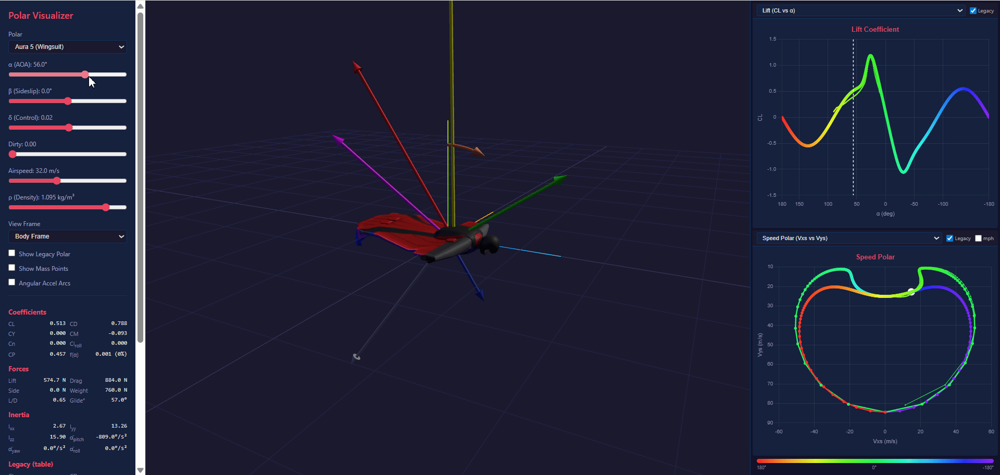

---

## Quick Start

```bash
# Clone and install
cd polar-visualizer
npm install

# Development server (hot reload)
npm run dev

# Production build
npm run build
npm run preview
```

The dev server will open at `http://localhost:5173`.

### Requirements

- Node.js 18+
- npm 9+

---

## Features

- **3D Viewer** — Three.js scene with OrbitControls, body-frame and inertial-frame rendering with independent φ/θ/ψ attitude control

<p align="center">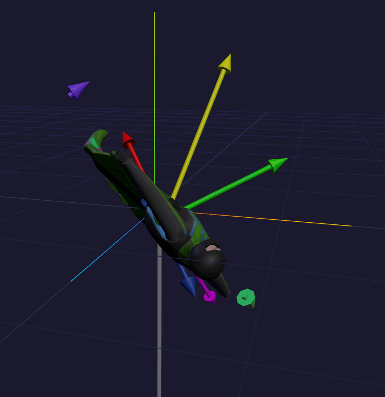</p>

<p align="center"></p>

- **Force Vectors** — Lift (blue), drag (red), side force (cyan), weight (yellow), net (white) as shaded 3D arrows originating from the center of pressure (CP) or center of gravity (CG)
- **Moment Arcs** — Pitch (red), yaw (green), roll (purple) curved arrows at CG
- **4 Models** — Aura 5 wingsuit, Ibex UL canopy, Slick Sin skydiver, Caravan airplane
- **Interactive Controls** — α (angle of attack), β (sideslip), δ (control input), dirty flying, airspeed, air density
- **6 Chart Views** — CL vs α, CD vs α, CP vs α, L/D vs α, CL vs CD (polar curve), Vxs vs Vys (speed polar)
- **Legacy Overlay** — Toggle to compare continuous model against legacy table-interpolated polars
- **Full Readout Panel** — All coefficients, forces, and sustained speeds displayed in real time

---

## How It Works

The entire system is built on two foundational pillars — if you understand these, every design decision in the project makes sense:

- **[Aerodynamic Model](docs/aero-model-overview.md)** — Kirchhoff separation theory blends attached-flow and flat-plate aerodynamics through a smooth sigmoid, giving every segment physically motivated coefficients at any orientation. [Full spec →](docs/KIRCHHOFF.md)

- **[Reference Frames](docs/frames-overview.md)** — Five coordinate frames (inertial, body, wind, Three.js, GLB) connected by explicit transforms. The rotating-frame derivative produces Coriolis and gyroscopic terms; per-segment ω×r correction generates automatic rate damping. [Full spec →](docs/FRAMES.md)

---

## Project Structure

```
polar-visualizer/
├── index.html              # App shell and layout
├── package.json
├── tsconfig.json
├── vite.config.ts
├── src/
│   ├── main.ts             # Entry point — wires everything together
│   ├── style.css            # Dark theme styling
│   ├── polar/               # Core aerodynamic math (UI-independent)
│   │   ├── continuous-polar.ts   # Type definitions (ContinuousPolar, SymmetricControl)
│   │   ├── kirchhoff.ts         # Separation function & flat-plate models
│   │   ├── coefficients.ts      # Full coefficient evaluation & force conversions
│   │   ├── polar-data.ts        # Legacy polars + continuous polar definitions
│   │   └── index.ts             # Barrel exports
│   ├── viewer/              # Three.js 3D rendering
│   │   ├── scene.ts             # Scene, camera, lights, OrbitControls
│   │   ├── model-loader.ts      # Procedural 3D models (wingsuit, canopy, etc.)
│   │   ├── vectors.ts           # Force vector & moment arc management
│   │   ├── shaded-arrow.ts      # Custom MeshPhongMaterial arrow geometry
│   │   └── curved-arrow.ts      # Moment arc (CurvedArrow) geometry
│   └── ui/                  # DOM controls and charts
│       ├── controls.ts          # Slider/dropdown bindings, FlightState
│       ├── readout.ts           # Coefficient & force readout panel
│       ├── chart-data.ts        # Sweep generators for polar charts
│       └── polar-charts.ts      # Chart.js dual-panel chart system
```

The `src/polar/` module is completely UI-independent and designed to be portable into other projects (e.g. CloudBASE flight simulator).

---

## The Continuous Polar Model

### Why Continuous?

Traditional aerodynamic polars in skydiving simulators use look-up tables with linear interpolation. These tables:
- Only cover a narrow AOA range (typically 0°–90° for wingsuits)
- Have no physics outside the table bounds
- Can't smoothly handle stall transitions
- Don't extend to back-flying, inverted, or tumbling orientations

The **continuous polar model** replaces tables with a parametric system that produces smooth, physically motivated coefficients for **any** angle of attack from -180° to +180° and any sideslip angle from -90° to +90°.

### Architecture Overview

The model works by blending two regimes:

```
Coefficient(α) = f(α) · Attached_Model(α) + (1 - f(α)) · FlatPlate_Model(α)
```

Where **f(α)** is the Kirchhoff separation function — a smooth value between 0 and 1 that describes how "attached" the airflow is:
- **f = 1**: Fully attached flow (normal flight)
- **f = 0**: Fully separated (flat-plate / deep stall)
- **0 < f < 1**: Transitional (stall region)

```
        ┌─────────────────────────────────────────────────────┐
        │  f(α) — Kirchhoff Separation Function               │
   1.0  │  ████████████████████████                            │
        │                        ██                            │
        │                          ██   ← Forward stall        │
        │                            ██   transition            │
   0.5  │                              ██                      │
        │                                ██                    │
        │                                  ██                  │
        │                                    ██████████████    │
   0.0  │                                                      │
        └─────────────────────────────────────────────────────┘
         -180°        -90°         0°         45°        180°
                           Angle of Attack (α)
```

---

## ContinuousPolar Parameters

The `ContinuousPolar` interface defines the complete aerodynamic character of a body. Every parameter below shapes the coefficient curves in a specific, interpretable way.

### Attached-Flow Lift Model

| Parameter | Units | Description |
|-----------|-------|-------------|
| `cl_alpha` | 1/rad | **Lift-curve slope.** How rapidly lift builds with angle of attack in attached flow. Wingsuit ≈ 2.9, canopy ≈ 3.5, airplane ≈ 4.8. Higher = more lift per degree. |
| `alpha_0` | deg | **Zero-lift angle of attack.** The AOA where CL = 0. Symmetric bodies ≈ 0°, cambered airfoils are negative (e.g. -3° for canopies). |

The attached lift model uses:

$$C_{L_{att}} = C_{L_\alpha} \cdot \sin(\alpha - \alpha_0)$$

Using `sin()` rather than a linear function gives better behavior in the transition zone near stall where separation begins but attached-flow math still contributes to the blend.

#### Effect of `cl_alpha`

Increasing `cl_alpha` steepens the lift curve in attached flow. For the Aura 5 wingsuit:

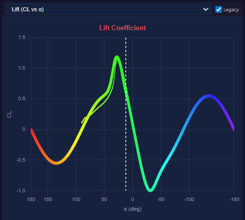
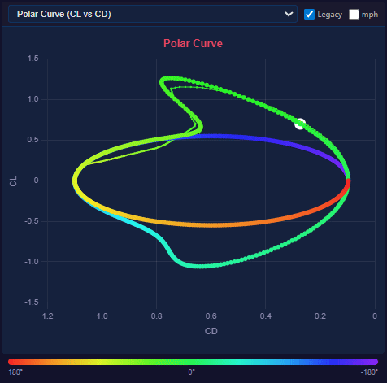

| `cl_alpha` | Peak CL (approx) | Character |
|------------|-------------------|-----------|
| 2.0 | ~0.85 | Low-efficiency body |
| **2.9** | **~1.15** | **Aura 5 baseline** |
| 4.0 | ~1.55 | High-aspect-ratio wing |

#### Effect of `alpha_0`

Shifting `alpha_0` slides the entire lift curve left or right without changing its shape:

| `alpha_0` | Zero-lift crossing | Character |
|-----------|-------------------|-----------|
| 0° | CL=0 at α=0° | Symmetric body (skydiver) |
| **-1°** | **CL=0 at α=-1°** | **Slight camber (wingsuit)** |
| -3° | CL=0 at α=-3° | Cambered airfoil (canopy) |

---

### Drag Model

| Parameter | Units | Description |
|-----------|-------|-------------|
| `cd_0` | — | **Parasitic drag coefficient.** Drag at zero lift. Airplane ≈ 0.029, wingsuit ≈ 0.10, skydiver ≈ 0.47. |
| `k` | — | **Induced drag factor.** How quickly drag grows with lift. Lower = more efficient. |

The attached drag model uses the classical drag polar:

$$C_{D_{att}} = C_{D_0} + K \cdot C_L^2$$

#### Effect of `cd_0`

`cd_0` shifts the entire drag curve up or down. It's the "floor" — the minimum drag the body can ever achieve in attached flow:

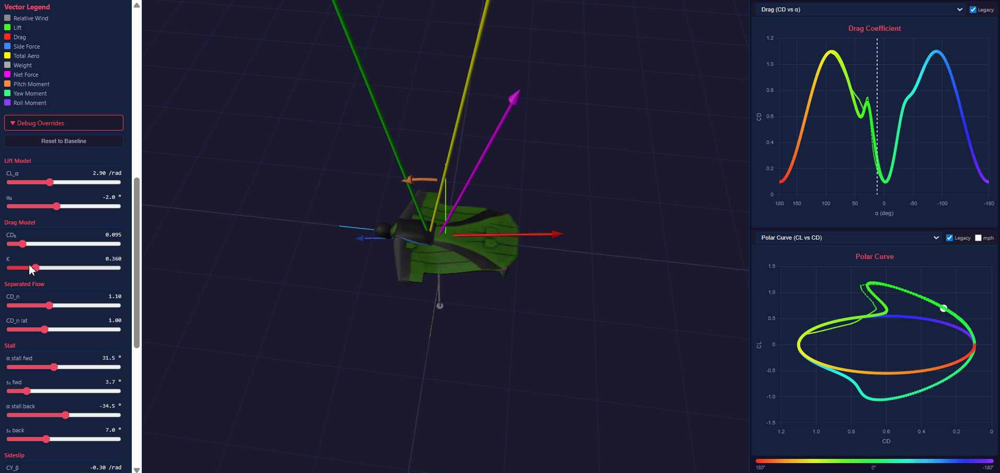

| Body | `cd_0` | Character |
|------|--------|-----------|
| Clean airplane | 0.029 | Very low parasitic drag |
| **Wingsuit** | **0.101** | **Moderate — streamlined human** |
| Canopy | 0.12 | Lines, fabric, suspension |
| Skydiver | 0.467 | High — exposed human body |

#### Effect of `k`

`k` controls how much drag penalty you pay for generating lift:

| `k` | L/D_max (approx) | Character |
|-----|-------------------|-----------|
| 0.15 | ~4.5 | Efficient canopy |
| **0.32** | **~3.2** | **Wingsuit baseline** |
| 0.485 | ~2.8 | Airplane (short field) |
| 0.70 | ~1.0 | Skydiver body |

---

### Flat-Plate / Separated Flow

| Parameter | Units | Description |
|-----------|-------|-------------|
| `cd_n` | — | **Normal-force drag coefficient.** Broadside drag when the body is perpendicular to the airflow (α = 90°). Typically 1.0–1.5. |
| `cd_n_lateral` | — | **Lateral broadside drag.** Same concept but for sideslip (β = 90°). |

When flow is fully separated (f → 0), the body behaves like a flat plate:

$$C_{L_{plate}} = C_{D_n} \cdot \sin(\alpha) \cdot \cos(\alpha)$$

$$C_{D_{plate}} = C_{D_n} \cdot \sin^2(\alpha) + C_{D_0} \cdot \cos^2(\alpha)$$

#### Effect of `cd_n`

`cd_n` controls the "roof" — the maximum drag at broadside orientation and the amplitude of flat-plate lift:

| `cd_n` | Drag at 90° | Flat-plate CL peak |
|--------|-------------|-------------------|
| 1.0 | 1.0 | 0.50 (at 45°) |
| **1.1** | **1.1** | **0.55** |
| 1.5 | 1.5 | 0.75 |

---

### Stall Parameters (Kirchhoff Separation)

| Parameter | Units | Description |
|-----------|-------|-------------|
| `alpha_stall_fwd` | deg | **Forward stall angle.** The AOA where the forward separation sigmoid is centered. Beyond this, flow rapidly detaches. |
| `s1_fwd` | deg | **Forward stall sharpness.** Smaller = sharper stall break. Larger = gradual, gentle stall. |
| `alpha_stall_back` | deg | **Back stall angle.** Where separation occurs for increasingly negative α (back-flying). |
| `s1_back` | deg | **Back stall sharpness.** Controls the transition width for back stall. |

The separation function is the product of two sigmoids:

$$f(\alpha) = f_{fwd}(\alpha) \cdot f_{back}(\alpha)$$

$$f_{fwd}(\alpha) = \frac{1}{1 + \exp\!\left(\frac{\alpha - \alpha_{stall,fwd}}{s_{1,fwd}}\right)}$$

$$f_{back}(\alpha) = \frac{1}{1 + \exp\!\left(\frac{\alpha_{stall,back} - \alpha}{s_{1,back}}\right)}$$

#### Effect of `alpha_stall_fwd`

Controls where CL peaks and starts dropping:

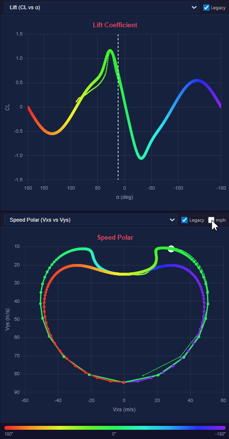

| `alpha_stall_fwd` | Stall onset | Character |
|--------------------|-------------|-----------|
| 22° | Early stall | Airplane (Caravan) |
| **34.5°** | **Late stall** | **Wingsuit (flexible surface)** |
| 45° | Very late | Nearly symmetric body (skydiver) |

#### Effect of `s1_fwd` (Stall Sharpness)

This is one of the most powerful parameters. It controls how abrupt the stall transition is:

| `s1_fwd` | Character | Description |
|-----------|-----------|-------------|
| 2° | Very sharp | Hard stall break — CL drops rapidly. Typical of thin airfoils. |
| **4°** | **Moderate** | **Progressive stall with clear break. Aura 5 & Caravan baseline.** |
| 8° | Gradual | Very gentle stall. Skydiver — almost no distinct stall point. |

```
CL vs α — Effect of s1_fwd (stall sharpness)

   CL
   │        ╱╲  s1=2° (sharp)
   │       ╱  ╲ 
   │      ╱ ╱──╲──  s1=4° (moderate)
   │     ╱ ╱     ╲──── 
   │    ╱╱     ╱────────  s1=8° (gradual)
   │   ╱╱    ╱
   │  ╱╱   ╱
   │ ╱╱  ╱
   │╱╱ ╱
   └──────────────────── α
   0°    20°    40°    60°
```

---

### Sideslip Model

| Parameter | Units | Description |
|-----------|-------|-------------|
| `cy_beta` | 1/rad | **Side force derivative.** Side force per radian of sideslip. Negative = force opposes sideslip (stabilizing). |
| `cn_beta` | 1/rad | **Yaw moment derivative.** Yaw moment per radian of sideslip. Positive = weathervane stability (nose into wind). |
| `cl_beta` | 1/rad | **Roll moment derivative.** Roll moment per radian of sideslip. Negative = dihedral effect (rolls away from sideslip). |

Sideslip affects all coefficients through crossflow scaling:

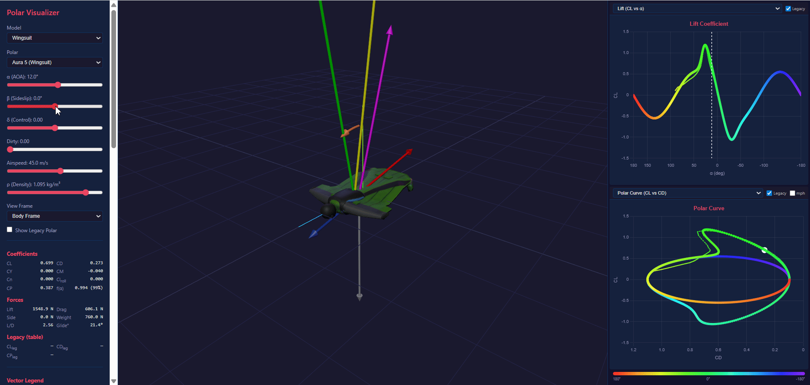

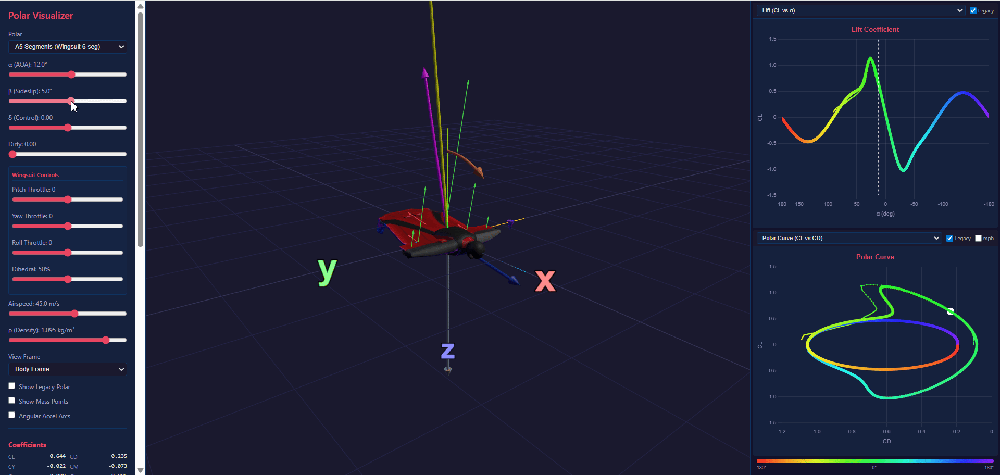

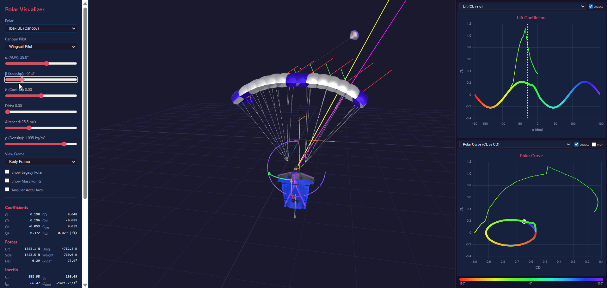

$$C_L(\alpha, \beta) = C_L(\alpha) \cdot \cos^2(\beta)$$

$$C_D(\alpha, \beta) = C_D(\alpha) \cdot \cos^2(\beta) + C_{D_n,lat} \cdot \sin^2(\beta)$$

$$C_Y = C_{Y_\beta} \cdot \sin(\beta) \cdot \cos(\beta)$$

---

### Pitching Moment & Center of Pressure

| Parameter | Units | Description |
|-----------|-------|-------------|
| `cm_0` | — | **Zero-alpha pitching moment.** Baseline nose-down tendency. Negative = nose-down (stable). |
| `cm_alpha` | 1/rad | **Pitch moment slope.** How pitching moment changes with α. Negative = statically stable. |
| `cp_0` | fraction | **CP at zero alpha.** Center of pressure location as a fraction of chord from the leading edge. |
| `cp_alpha` | 1/rad | **CP travel with α.** How CP moves as α increases. Negative = CP moves forward with increasing α. |
| `cg` | fraction | **Center of gravity.** CG location as fraction of chord from leading edge. Forces and moments reference this point. |
| `chord` | m | **Reference chord / body length.** Used for moment arm calculations and 3D model scaling. |

When flow separates, pitching moment and CP blend to flat-plate values:

$$C_M = f \cdot (C_{M_0} + C_{M_\alpha} \cdot \alpha_{eff}) + (1-f) \cdot C_{M_{plate}}$$

$$CP = f \cdot CP_{attached} + (1-f) \cdot CP_{plate}$$

The flat-plate CP moves from 0.25 (thin airfoil center) toward 0.50 (geometric center) as α → 90°.

---

### Physical Properties

| Parameter | Units | Description |
|-----------|-------|-------------|
| `s` | m² | **Reference area.** Wing area or projected body area used in force equations. |
| `m` | kg | **Mass.** Total system mass (body + suit/canopy/aircraft). |
| `chord` | m | **Reference length.** Used for moment non-dimensionalization. Also determines 3D model scale. |
| `cp_lateral` | fraction | **Lateral CP.** Where side forces originate along the chord. |

---

### Symmetric Controls (`SymmetricControl`)

The control system allows any number of control axes (brake, front riser, rear riser, dirty flying) to **morph the base polar parameters** linearly with a control input δ ∈ [-1, +1]:

$$P(\delta) = P_{base} + \delta \cdot \Delta P$$

Each `SymmetricControl` specifies how much each base parameter shifts per unit of δ:

| Derivative | What it morphs | Typical use |
|------------|---------------|-------------|
| `d_alpha_0` | Zero-lift AOA | Brakes add camber → α₀ shifts negative |
| `d_cd_0` | Parasitic drag | Brakes/dirty increase drag |
| `d_cl_alpha` | Lift slope | Dirty flying reduces lift efficiency |
| `d_k` | Induced drag factor | Dirty flying worsens span efficiency |
| `d_alpha_stall_fwd` | Forward stall angle | Brakes lower stall AOA |
| `d_alpha_stall_back` | Back stall angle | Rarely used |
| `d_cd_n` | Broadside drag | Morphs separated-flow drag |
| `d_cp_0` | CP position | Brakes shift CP aft |
| `d_cp_alpha` | CP travel rate | Controls CP sensitivity |
| `cm_delta` | Pitch moment | Direct pitch trim from control input |

#### Example: Wingsuit Dirty Flying

The wingsuit `dirty` control models the effect of a relaxed, non-tensioned body position:

```typescript
dirty: {
  d_cd_0:             0.025,   // +2.5% parasitic drag (loose suit)
  d_cl_alpha:        -0.3,     // Less efficient lift generation
  d_k:                0.08,    // Worse span efficiency
  d_alpha_stall_fwd: -3.0,     // Stalls 3° earlier
  d_cp_0:             0.03,    // CP moves toward CG
  d_cp_alpha:         0.02,    // Less CP travel
}
```

At `dirty = 1.0`, the effective polar becomes:
- `cl_alpha`: 2.9 → 2.6 (less lift per degree)
- `cd_0`: 0.101 → 0.126 (higher drag floor)
- `alpha_stall_fwd`: 34.5° → 31.5° (earlier stall)

---

### Canopy Brake Controls & Flap Segments


Canopy brakes are modelled with **three simultaneous effects** that act together when the pilot pulls a toggle:

1. **Primary — Flap segments.** Six dedicated `AeroSegment`s represent the deflected trailing-edge fabric. They are created by `makeBrakeFlapSegment()` in `segment-factories.ts` and produce their own lift and drag via `BRAKE_FLAP_POLAR`.
2. **Secondary — Camber change.** A `SymmetricControl` named `brake` on each canopy cell morphs the cell's base polar (shifts α₀, increases cd₀, moves CP aft, etc.).
3. **Tertiary — α coupling.** Each cell segment adds a small angle-of-attack increment proportional to brake input (`BRAKE_ALPHA_COUPLING_DEG = 2.5°` per unit), simulating the overall pitch-up as brakes load the trailing edge.

#### Brake input routing

The UI exposes `brakeLeft` and `brakeRight` (0 → 1). Each flap segment has a `brakeSensitivity` (0 → 1) that scales the raw input — outer flaps respond fully while inner flaps move less:

| Segment pair | Chord fraction | Sensitivity | Position (x) |
|--------------|---------------|-------------|---------------|
| `flap_r3 / flap_l3` (outer) | 30% of cell chord | 1.0 | −0.689 |
| `flap_r2 / flap_l2` (mid) | 20% | 0.7 | −0.672 |
| `flap_r1 / flap_l1` (inner) | 10% | 0.4 | −0.664 |

The effective brake for each flap is `clamp(rawBrake × sensitivity, 0, 1)`.

#### `makeBrakeFlapSegment()` — what it does

Each call stores a **base trailing-edge position** from `polar-data.ts`. On every frame `getCoeffs()`:

1. Computes `effectiveBrake` from the raw input and sensitivity.
2. Scales **reference area** (`S`) and **chord** from zero up to their full values proportionally to `effectiveBrake`. This means retracted flaps produce zero force — they don't exist as a surface until the pilot pulls the toggle.
3. Interpolates the segment's **x position** from the canopy's aerodynamic-center line forward toward the trailing edge as the flap deploys.
4. Adds a **flap deflection angle** (`effectiveBrake × MAX_FLAP_DEFLECTION_DEG`, default 50°) to the local α so the segment sees a high angle of attack even when the canopy is flying level.

#### `BRAKE_FLAP_POLAR`

The flap segments use their own Kirchhoff polar tuned for a thin, cambered fabric surface:

| Parameter | Value | Rationale |
|-----------|-------|-----------|
| `cl_alpha` | 4.0 | High lift slope — small, highly cambered surface |
| `cd_0` | 0.02 | Clean fabric baseline drag |
| `k` | 0.05 | Low induced drag factor (high AR flap strip) |
| `alpha_stall_fwd` | 35° | Wide attached-flow range so light brake input improves L/D before drag dominates |
| `s1_fwd` | 5° | Gentle stall transition |
| `cm_0` | −0.05 | Mild nose-down moment |
| `cp_0` | 0.60 | CP aft of mid-chord |

#### Modifying the brake system

- **Flap strength / drag.** Adjust `cd_0` and `k` in `BRAKE_FLAP_POLAR` (in `polar-data.ts`). Raising `k` makes brakes draggier at high deflection.
- **Stall onset.** Lower `alpha_stall_fwd` to make flaps stall earlier (more drag at mid-range brake). Raise it to keep lift attached longer.
- **Sensitivity cascade.** Change the per-segment `brakeSensitivity` values in the flap definitions in `polar-data.ts` to reshape the graduated response.
- **Chord fractions.** The `chord` value of each flap segment (as a fraction of the cell chord) determines how much trailing edge it represents. Increase for stronger brakes.
- **Camber / cell effect.** Edit the `brake` `SymmetricControl` on the canopy cell polar to change how much the cells themselves respond to brake input.
- **α coupling.** Change `BRAKE_ALPHA_COUPLING_DEG` in `segment-factories.ts` to strengthen or weaken the pitch-up tendency.

---

### Pilot Pitch

<p align="center"></p>

The **Pilot Pitch** slider rotates the pilot body about the riser attachment point, changing the angle of attack that the pilot's lifting-body segment sees relative to the freestream. This models real-world body position changes — from head-up (positive pitch) through neutral to head-down (negative pitch).

Because the pilot segment is evaluated as a full Kirchhoff lifting body with its own polar, pitching the body shifts it through the entire CL–α curve independently of the canopy cells. The effect on the system polar is significant:

- **Head-up** — The pilot's body presents more frontal area at high α, adding substantial drag. Combined with the canopy at normal flying angles, this increases total system drag and steepens the glide. At extreme head-up angles the pilot body can backslide, producing negative horizontal speed in the speed polar.
- **Head-down** — The pilot body streamlines along the flight path, reducing its drag contribution. The system becomes more canopy-dominated, resulting in a flatter glide and higher forward speed.
- **Neutral** — The pilot hangs at the default pitch angle, matching the baseline system polar.

The pitch rotation is applied via a `pilotPivot` group in the Three.js scene graph, with the pivot origin at the riser/harness attachment point so the rotation looks physically correct. The aerodynamic effect flows through the pilot's `pitchOffset_deg` parameter in the lifting-body segment factory.

---

### Deployment

<p align="center">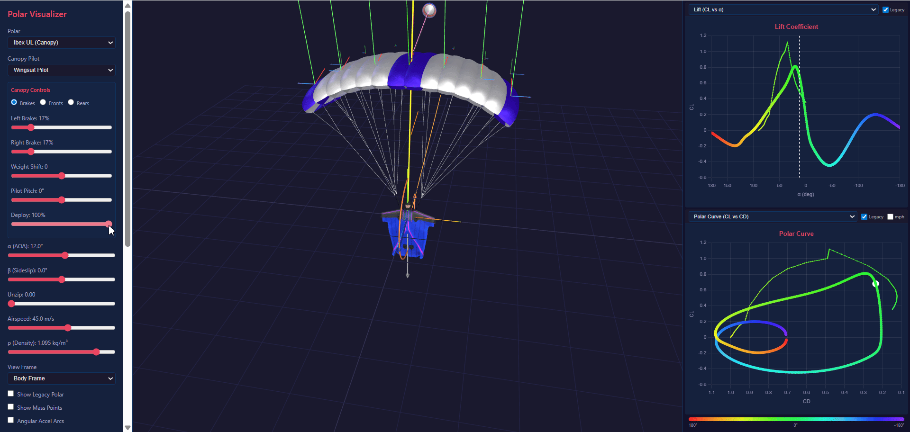</p>

The **Deploy** slider (0–100%) models the canopy opening sequence from line stretch through full inflation. Deployment coordinates three systems simultaneously:

**3D Model Scaling.** The canopy GLB mesh scales horizontally around its quarter-chord origin. Span compresses to 10% at deploy=0, chord to 30%, while height (line length) stays constant. This keeps the canopy visually centered over the pilot throughout the opening.

**Segment Geometry.** Each cell and flap segment scales its reference area ($S = S_{full} \times chordScale \times spanScale$), chord length, and span-wise position to match the visual model. A tunable chord-wise offset (`DEPLOY_CHORD_OFFSET`) lerps the arrow positions to track the scaled GLB mesh, compensating for the different coordinate origins between the abstract aero model and the 3D scene.

**Coefficient Morphing.** At low deployment the canopy is uninflated fabric, not an airfoil. The Kirchhoff polar parameters are morphed per-frame:

| Parameter | Deploy = 0 | Deploy = 1 | Effect |
|-----------|-----------|-----------|--------|
| `cd_0` | 2× base | 1× base | Higher parasitic drag from flapping fabric |
| `cl_alpha` | 30% of base | 100% | Poor lift — no airfoil shape |
| `cd_n` | 1.5× base | 1× base | More frontal drag from bundled fabric |
| `alpha_stall_fwd` | −17° offset | 0° offset | Stall onset drops to ~5° — fabric separates immediately |
| `s1_fwd` | 4× base | 1× base | Very broad stall transition — no sharp separation |

All morphing constants are exported from `segment-factories.ts` for easy tuning. The morphing is skipped entirely at deploy=1 (no performance cost in normal flight).

The result is a smooth transition in the speed polar from a high-drag, low-lift bundle at line stretch through to the full performance envelope at open. At 0% deployment in head-down orientation, the system descends at roughly 60 mph — matching real-world deployment speeds.

---

### Unzip (Wingsuit → Slick Transition)

The **Unzip** slider (visible only in canopy + wingsuit pilot mode) continuously morphs the pilot segment between its wingsuit polar and its slick (unzipped) polar. At unzip = 0, the pilot uses the full wingsuit aerodynamics — large reference area, high lift slope, low parasitic drag. At unzip = 1, it switches to the slick skydiver polar — smaller area, lower lift, higher parasitic drag.

Intermediate values linearly interpolate (`lerpPolar`) every parameter between the two polars, including `S`, `chord`, `cl_alpha`, `cd_0`, `k`, stall angles, and all moment derivatives. This is implemented by `makeUnzippablePilotSegment()` in `segment-factories.ts`, which stores both polars at factory time and blends them per-frame based on `controls.unzip`.

The slider is hidden for the slick pilot model (no wingsuit to unzip) and repurposes the δ (control) slider position in the UI — the label changes to "Unzip" automatically when the canopy + wingsuit configuration is selected.

---

### Euler Rate Controls & Per-Segment Velocity

<p align="center">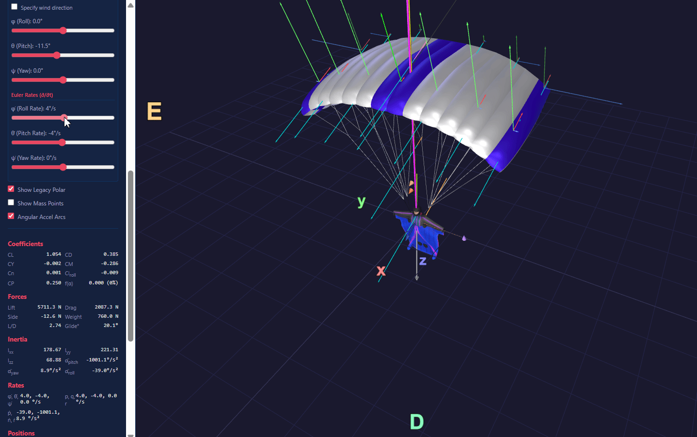</p>

The **Euler rate sliders** (φ̇, θ̇, ψ̇) let you impose steady-state rotation on the body and observe how it changes the local airflow at each aerodynamic segment. When the system rotates, every segment away from the CG picks up an additional velocity component from $\boldsymbol{\omega} \times \mathbf{r}$, where $\mathbf{r}$ is the segment's position relative to the center of mass. Wingtip segments see the largest effect; segments near the CG see almost none.

The math pipeline converts the UI Euler rates to body-axis angular velocity $(p, q, r)$ via the **inverse DKE** (Direction Kinematic Equation), then passes $\boldsymbol{\omega}$ into `evaluateAeroForcesDetailed()` which computes each segment's local velocity as:

$$\mathbf{V}_{local,i} = \mathbf{V}_{body} + \boldsymbol{\omega} \times \mathbf{r}_i$$

The cyan arrows in the 3D view show these per-segment velocity vectors. In the GIF above, a roll rate shifts the local velocity asymmetrically — the advancing wing sees higher airspeed and the retreating wing sees lower airspeed, producing differential lift and the associated rolling/yawing moments visible in the moment arcs.

Full derivation and implementation checklist: [SIMULATION.md](docs/SIMULATION.md) §15–§16.

---

## Segment Force Summation & System Aerodynamics

When a polar has multiple `AeroSegment`s (canopy cells, flap segments, lines, pilot, etc.), the system-level coefficients and sustained speeds aren't read from a single polar — they're **built up from first principles** by summing forces and moments across every segment.

### Per-Segment Evaluation

Each segment has its own Kirchhoff polar, reference area $S_i$, chord $c_i$, and position in the NED body frame. On every frame, each segment's `getCoeffs(α, β, controls)` evaluates its local coefficient set $\{C_L, C_D, C_Y, C_M, CP\}$, handling control response, pitch offsets, and local flow transforms internally. The physical forces are then:

$$L_i = q \cdot S_i \cdot C_{L,i} \qquad D_i = q \cdot S_i \cdot C_{D,i} \qquad Y_i = q \cdot S_i \cdot C_{Y,i}$$

$$M_{0,i} = q \cdot S_i \cdot c_i \cdot C_{M,i}$$

where $q = \tfrac{1}{2}\rho V^2$ is the dynamic pressure.

### Wind Frame → Body Frame

Forces are computed in the NED wind frame — lift perpendicular to the airflow, drag opposing it, side force lateral — then projected into body-frame NED coordinates:

$$\vec{F}_i = L_i \cdot \hat{l} - D_i \cdot \hat{w} + Y_i \cdot \hat{s}$$

The wind direction $\hat{w}$, lift direction $\hat{l}$, and side direction $\hat{s}$ are orthonormal vectors constructed from $(\alpha, \beta)$ via double cross-product with the NED vertical reference.

### CP Position & Moment Arms

Each segment's center of pressure is offset from its aerodynamic center (at quarter-chord) along the chord direction. The offset is rotated by the segment's `pitchOffset_deg` in the x-z plane to handle upright bodies (pilot hanging under canopy at 90°) versus prone bodies (wingsuit at 0°):

$$\Delta x_{CP} = -(CP - 0.25) \cdot \frac{c_{seg}}{h}$$

$$\vec{r}_{CP,i} = \vec{r}_{seg,i} + \Delta x_{CP} \cdot (\cos\theta_p,\; 0,\; \sin\theta_p)$$

where $h$ = 1.875 m (reference height) and $\theta_p$ is the pitch offset. The lever arm from the system CG is then:

$$\vec{r}_i = \vec{r}_{CP,i} \cdot h - \vec{r}_{CG}$$

### Force & Moment Summation

Total aero force and moment about the system CG are accumulated across all segments. Each segment contributes **two** moment terms — one from its lever arm and one from its intrinsic pitching moment:

$$\vec{F}_{total} = \sum_i \vec{F}_i$$

$$\vec{M}_{total} = \sum_i \left(\vec{r}_i \times \vec{F}_i \;+\; M_{0,i} \cdot \hat{y}\right)$$

The lever arm cross product creates pitch, yaw, and roll moments from off-CG forces. The intrinsic pitching moment $M_{0,i}$ adds each segment's own pitch tendency (from camber, flap deflection, etc.) directly about the NED y-axis.

### System Coefficient Recovery

The summed body-frame force is decomposed back into wind-frame scalars via dot products, then non-dimensionalized to recover system-level coefficients:

$$C_L = \frac{\hat{l} \cdot \vec{F}_{total}}{qS_{ref}} \qquad C_D = \frac{-\hat{w} \cdot \vec{F}_{total}}{qS_{ref}} \qquad C_M = \frac{M_y}{qS_{ref} \cdot c_{ref}}$$

These are the coefficients displayed on the charts and in the readout panel — they emerge from the geometry and interactions of all segments rather than from a single interpolated polar.

### System Center of Pressure

The system CP is derived from the moment-balance relationship. Since $C_M = C_N \cdot (CG - CP)$, solving for CP gives:

$$CP_{sys} = CG - \frac{C_M}{C_N}$$

where the **normal-force coefficient** $C_N = C_L \cos\alpha + C_D \sin\alpha$ captures both lift and drag contributions to the pitching moment arm. This stays positive at all angles of attack and correctly tracks how drag-dominated forces shift the effective CP in deep stall. When $|C_N| < 0.02$ (near zero normal force), CP falls back to the CG position.

### Sustained Speeds from Segments

The system $C_L$ and $C_D$ from segment summation feed into the same equilibrium glide equations used for monolithic polars — there's no separate formula. The speed polar charts sweep $\alpha$ from $-180°$ to $+180°$, and at each point the full segment pipeline runs: evaluate all segments, sum forces, recover system coefficients, compute sustained speeds. This means the speed polar automatically captures interactions like brake-induced drag, differential flap loading, deployment morphing, and dirty flying — anything that changes any segment's contribution flows through to the system performance envelope.

---

## Sustained Speed Polar

Given CL and CD at a particular α, the model computes equilibrium glide speeds:

$$V = \sqrt{\frac{2mg}{\rho S \sqrt{C_L^2 + C_D^2}}}$$

$$V_{xs} = V \cdot \frac{C_L}{\sqrt{C_L^2 + C_D^2}} \qquad V_{ys} = V \cdot \frac{C_D}{\sqrt{C_L^2 + C_D^2}}$$

Where Vxs is horizontal speed and Vys is vertical (sink) speed. The speed polar chart plots these across all α, revealing the performance envelope — best glide ratio, minimum sink, and speed range.

---

## Legacy Polar Comparison

The visualizer includes a **legacy overlay** that plots the original table-interpolated polar data (from CloudBASE) on top of the continuous model curves. This allows direct comparison to validate that the continuous model accurately captures the flight characteristics that were empirically measured.

Legacy polars use the `WSEQPolar` format — arrays of CL, CD, and CP values at discrete AOA points with linear interpolation between them. The legacy data only covers a limited AOA range (e.g. 0°–90° for wingsuits), while the continuous model extends to the full ±180°.

Toggle the **Legacy** checkbox on any chart to show/hide the thin-line legacy trace.

---

## Charts

The visualizer includes two chart panels, each with a dropdown selector:

**Chart 1 (α-based):**
- CL vs α — Lift coefficient curve
- CD vs α — Drag coefficient curve
- CP vs α — Center of pressure travel
- L/D vs α — Glide ratio (lift-to-drag)

**Chart 2 (cross-plots):**
- CL vs CD — Polar curve (drag polar)
- Vxs vs Vys — Speed polar (toggle mph/m·s⁻¹)

All charts use AOA-colored points (rainbow mapping from -180° to +180°) with a white cursor dot tracking the current α.

---

## Tech Stack

| Layer | Technology | Purpose |
|-------|-----------|---------|
| Build | Vite 6 | Dev server & production bundling |
| Language | TypeScript 5.7 | Strict mode, ESNext modules |
| 3D | Three.js 0.170 | WebGL rendering, OrbitControls |
| Charts | Chart.js 4.5 | 2D scatter/line charts |
| Math | Custom | Kirchhoff separation, Kirchhoff blending |

---

## License

MIT License — see [LICENSE](LICENSE) for details.

**Exception:** The 3D model files in `polar-visualizer/public/models/` are All Rights Reserved and not covered by the MIT License.
