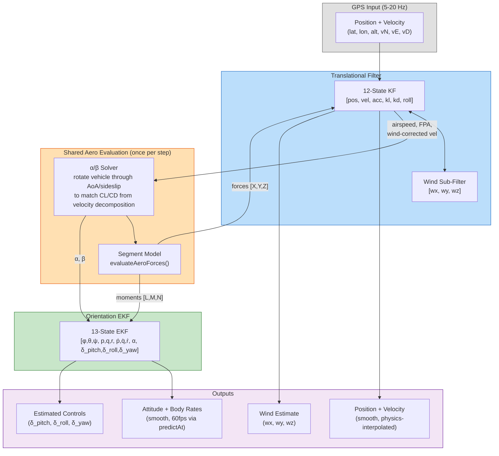
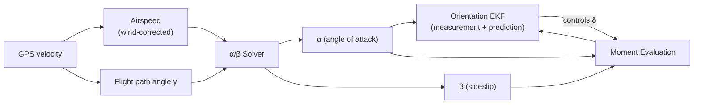
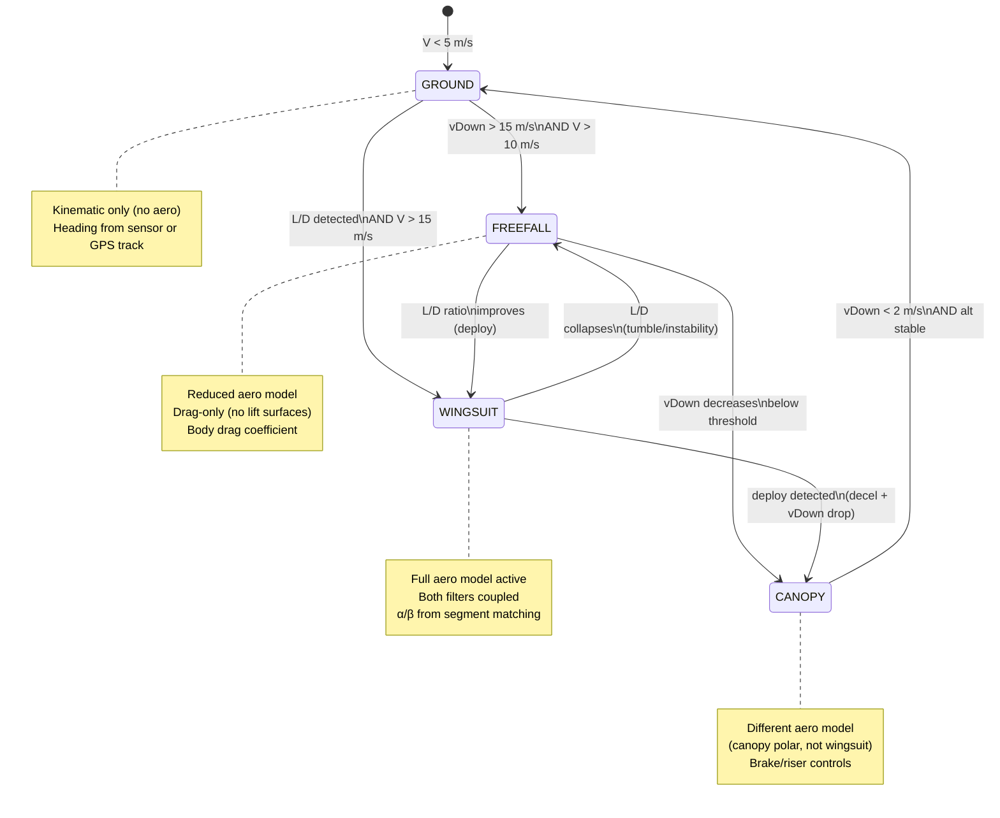
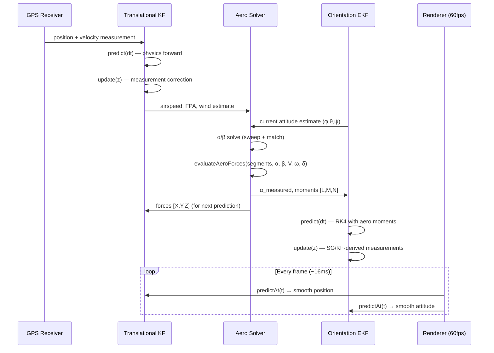

# Filter Architecture — Polar Project

> Living design document for the dual-filter flight dynamics system.
> Updated in lockstep with code changes. Last revised: 2026-03-31.

---

## Table of Contents

1. [System Overview](#1-system-overview)
2. [Signal Flow — Big Picture](#2-signal-flow--big-picture)
3. [Translational Filter](#3-translational-filter)
4. [Orientation EKF](#4-orientation-ekf)
5. [Shared Aero Evaluation](#5-shared-aero-evaluation--the-αβ-problem)
6. [Flight Mode State Machine](#6-flight-mode-state-machine)
7. [Per-Step Sequence](#7-per-step-sequence)
8. [Batch vs Real-Time Modes](#8-batch-vs-real-time-modes)
9. [Open Design Questions](#9-open-design-questions)
10. [File Map](#10-file-map)

---

## 1. System Overview

Two coupled Extended Kalman Filters reconstruct full 6DOF flight state from GPS data:

| Filter | Domain | What it produces |
|--------|--------|-----------------|
| **Translational KF** | Position, velocity, acceleration, wind | Where the vehicle is and how fast it's going |
| **Orientation EKF** | Attitude, body rates, α, pilot controls | How the vehicle is oriented and what the pilot is doing |

The filters are coupled through the **aerodynamic model** — the same segment-based aero evaluation that the polar visualizer uses. The translational filter provides airspeed and flight path, the orientation filter provides attitude and controls, and the aero model connects them through forces and moments.

**Critical constraint:** The aero model evaluation (rotating the vehicle through α/β to match aerodynamic coefficients) is computationally expensive. It must be computed **once per filter step** and shared between both filters.

---

## 2. Signal Flow — Big Picture



### Data Dependencies



**Key insight:** α and β are needed by BOTH filters. The translational filter extracts them from velocity decomposition (CL/CD matching), and the orientation filter needs them for moment prediction AND as measurements. Computing them once and sharing is essential.

---

## 3. Translational Filter

> Source: `/mnt/c/dev/kalman/src/kalman.ts` (KalmanFilter3D)
> To be ported/integrated into `polar-visualizer/src/kalman/`

### State Vector (12)

| Index | Symbol | Units | Description |
|-------|--------|-------|-------------|
| 0 | x | m | Position East |
| 1 | y | m | Position North |
| 2 | z | m | Position Up |
| 3 | vx | m/s | Velocity East |
| 4 | vy | m/s | Velocity North |
| 5 | vz | m/s | Velocity Up |
| 6 | ax | m/s² | Acceleration East |
| 7 | ay | m/s² | Acceleration North |
| 8 | az | m/s² | Acceleration Up |
| 9 | kl | – | Lift coefficient parameter |
| 10 | kd | – | Drag coefficient parameter |
| 11 | roll | rad | Bank angle |

### Measurements (6)

| Index | Source | Description |
|-------|--------|-------------|
| 0-2 | GPS | Position (East, North, Up) |
| 3-5 | GPS | Velocity (East, North, Up) |

### Prediction Model

Physics-based: `calculateWingsuitAcceleration(v, kl, kd, roll)` propagates state using the polar model. Three integration methods available (Newton, WSE, Wind-adjusted).

### Wind Sub-Filter (3)

Separate 3-state Kalman filter estimates `[wx, wy, wz]`. Gradient descent minimizes acceleration residual against the polar model. Wind estimate is used to convert ground-frame velocity to air-frame velocity (→ airspeed, → α/β).

### Key Features
- **Step smoothing**: Blends out measurement correction linearly over one GPS interval → smooth output between samples
- **`predictAt(t)`**: Forward-predicts using physics model → exact interpolation for replay/rendering
- **Adaptive Q/R**: NIS-based tuning (can be ignored for initial integration)

---

## 4. Orientation EKF

> Source: `polar-visualizer/src/kalman/orientation-ekf.ts`

### State Vector (13)

| Index | Symbol | Units | Description | Dynamics |
|-------|--------|-------|-------------|----------|
| 0 | φ | rad | Roll angle | DKE from p,q,r |
| 1 | θ | rad | Pitch angle | DKE from p,q,r |
| 2 | ψ | rad | Heading | DKE from p,q,r |
| 3 | p | rad/s | Body roll rate | Euler's equations (aero moments) |
| 4 | q | rad/s | Body pitch rate | Euler's equations (aero moments) |
| 5 | r | rad/s | Body yaw rate | Euler's equations (aero moments) |
| 6 | ṗ | rad/s² | Roll acceleration | Random walk (Q-driven) |
| 7 | q̇ | rad/s² | Pitch acceleration | Random walk (Q-driven) |
| 8 | ṙ | rad/s² | Yaw acceleration | Random walk (Q-driven) |
| 9 | α | rad | Angle of attack | Random walk (Q-driven) |
| 10 | δ_pitch | [-1,1] | Pitch throttle | Random walk (Q-driven) |
| 11 | δ_roll | [-1,1] | Roll throttle | Random walk (Q-driven) |
| 12 | δ_yaw | [-1,1] | Yaw throttle | Random walk (Q-driven) |

### Measurements (7)

| Index | Symbol | Source | Notes |
|-------|--------|--------|-------|
| 0 | φ | SG pipeline | GPS-derived roll from velocity decomposition |
| 1 | θ | SG pipeline | Pitch = γ_air + α·cos(φ) |
| 2 | ψ | SG pipeline | Heading with β correction |
| 3 | p | SG pipeline | LS derivative of SG-smoothed Euler → inverse DKE |
| 4 | q | SG pipeline | " |
| 5 | r | SG pipeline | " |
| 6 | α | SG pipeline | From segment model matching in extractAero() |

**All measurements are pseudo-measurements** — derived from GPS via the Savitzky-Golay pipeline. No direct IMU/sensor input. In real-time mode, the translational KF replaces the SG pipeline as the source of these pseudo-measurements.

### Prediction Model

1. Evaluate segment aero model at current (α, V, ω, controls) → moments [L, M, N]
2. Euler's rotational equations (diagonal inertia): `Ixx·ṗ = L - (Izz-Iyy)·q·r`, etc.
3. Kinematic equations (DKE): body rates (p,q,r) → Euler angle rates (φ̇, θ̇, ψ̇)
4. RK4 integration with sub-stepping (max 20ms steps)

### Control Estimation

Controls (δ_pitch, δ_roll, δ_yaw) are **never directly measured**. The filter estimates them as "what control inputs, given the aero model, explain the observed orientation changes." Process noise on controls (~0.5/s) sets how fast pilot inputs can change. This replaces the Newton-Raphson inverse solver.

### Noise Parameters (Current Defaults)

| Parameter | Value | Description |
|-----------|-------|-------------|
| **Process (Q)** | | |
| qAngles | 0.01 | ~0.6°/step at 5 Hz |
| qRates | 0.1 rad/s | Body rate diffusion |
| qAccel | 1.0 rad/s² | Angular accel changes quickly |
| qAlpha | 0.01 | α changes slowly in steady flight |
| qControls | 0.5 | Control inputs can change ~0.5/s |
| **Measurement (R)** | | |
| rAngles | 0.03 | ~1.7° — GPS-derived angles |
| rRates | 0.05 rad/s | LS-derived rate noise |
| rAlpha | 0.05 | ~3° — segment model matching |
| **Initial (P₀)** | | |
| p0Angles | 0.5 | ~30° — very uncertain at start |
| p0Rates | 1.0 rad/s | |
| p0Accel | 5.0 rad/s² | |
| p0Alpha | 0.2 | ~12° |
| p0Controls | 1.0 | Full range uncertain |

---

## 5. Shared Aero Evaluation — The α/β Problem

### The Problem

Both filters need angle of attack (α) and sideslip (β):

- **Translational filter**: Decomposes velocity into lift/drag via CL/CD matching → needs α to evaluate the polar
- **Orientation filter**: Uses α as both a measurement and a prediction input → needs α for moment evaluation AND as state variable

The aero model evaluation (rotating the vehicle through a sweep of α values, evaluating all segments, matching coefficients) is the most expensive computation in the pipeline. Doing it twice per step is wasteful and inconsistent.

### Current Architecture (Batch Mode)

```
SG Pipeline → extractAero() → α (per GPS point)
                                ↓
                     Orientation EKF measurement[6] = α
                     AeroAdapter.evaluateMoments(α, V, ω, δ) → [L,M,N]
```

In batch mode, α comes from the SG pipeline's `extractAero()` which sweeps through angle of attack to match observed CL/CD from the velocity decomposition. This α feeds into the orientation EKF both as a measurement and as input to the aero model prediction.

### Target Architecture (Real-Time Mode)

```
GPS measurement
    ↓
Translational KF update → airspeed, flight path angle, wind
    ↓
α/β Solver (one evaluation per step)
    ↓
    ├── α, β → Orientation EKF (measurement update)
    ├── moments [L,M,N] → Orientation EKF (prediction model)
    └── forces [X,Y,Z] → Translational KF (prediction model)
```

**Design goal:** Single aero evaluation per GPS step, results shared to both filters.

### β (Sideslip)

Currently not tracked. The orientation EKF builds body velocity as `(V·cos(α), 0, V·sin(α))` — zero sideslip assumption. β should be:

- Estimated from lateral acceleration / GPS track vs heading divergence
- Fed into the aero model for asymmetric force/moment evaluation
- Potentially added to the orientation EKF state vector (14th state) or computed from translational KF output

---

## 6. Flight Mode State Machine



### Filter Configuration Per Mode

| Mode | Translational KF | Orientation EKF | Aero Model | Controls |
|------|-------------------|-----------------|------------|----------|
| **GROUND** | Position only, low Q | Kinematic only (zero moments) | OFF | None |
| **FREEFALL** | Full, body drag | Kinematic + body drag moments | Body drag | None |
| **WINGSUIT** | Full, WSE physics | Full aero moments | Wingsuit segments | pitch/roll/yaw throttle |
| **CANOPY** | Full, canopy physics | Full aero moments | Canopy segments | brake/riser/weightShift |

**Mode transitions** affect which aero model is loaded into the `AeroMomentAdapter` and what control mapper is active. The state vectors don't change size — only the prediction model changes.

---

## 7. Per-Step Sequence



### Step Ordering (within one GPS update)

1. **Translational KF predict** — advance state to current GPS time using physics
2. **Translational KF update** — incorporate GPS position + velocity
3. **Aero evaluation** — compute α/β from updated velocity + current attitude estimate
4. **Evaluate forces/moments** — full segment model at solved α/β with current controls
5. **Orientation EKF set airspeed** — from translational KF output
6. **Orientation EKF predict** — RK4 forward using cached moments
7. **Orientation EKF update** — pseudo-measurements (from SG pipeline in batch, from translational KF in real-time)
8. **Cache results** — store forces/moments for next translational prediction step

Between GPS updates, both filters respond to `predictAt(t)` calls for smooth 60fps rendering.

---

## 8. Batch vs Real-Time Modes

### Batch Mode (Current — GPS Viewer Replay)

```
Full flight CSV loaded
    ↓
SG Pipeline (knows all future data)
    ↓
extractAero() batch → α per point
    ↓
Orientation EKF runs sequentially over all points
    ↓
Replay with predictAt() interpolation
```

- SG filter is non-causal (uses future data for smoothing)
- α comes from batch-optimal velocity decomposition
- Both filters run after all data is available
- `predictAt()` used only for rendering interpolation

### Real-Time Mode (Target — Live or Causal Replay)

```
GPS measurement arrives
    ↓
Translational KF predict + update
    ↓
α/β from KF-smoothed velocity (causal only)
    ↓
Orientation EKF predict + update
    ↓
predictAt() for rendering until next GPS
```

- No future data — fully causal
- Translational KF replaces SG pipeline as smoother
- α/β from KF velocity decomposition (noisier than SG, but real-time)
- `predictAt()` used for both rendering AND state estimation between samples
- Wind estimation runs in parallel (gradient descent sub-filter)

### Parallel Operation

In batch mode, both can run and be compared:
- SG pipeline = batch-optimal ground truth
- KF pipeline = causal estimate (how good is it without future data?)

This comparison is valuable for tuning noise parameters and validating the real-time filter against known-good batch results.

---

## 9. Open Design Questions

### 9.1 — β (Sideslip) Ownership

Where does sideslip live?
- **Option A**: 14th state in orientation EKF (β as random walk, measured from lateral acceleration)
- **Option B**: Computed by translational KF from GPS track vs heading divergence
- **Option C**: Computed in shared aero solver from lateral force balance

β affects both force AND moment evaluation. Getting it wrong corrupts both filters.

### 9.2 — α Duplication

Currently α exists in both filters:
- Translational KF: implicitly via kl/kd (which encode the polar operating point → α)
- Orientation EKF: explicitly as state[9]

Should α be computed once in the aero solver and injected into both filters as a measurement? Or should each filter maintain its own α estimate with the shared solver as a consistency check?

### 9.3 — Aero Evaluation Cache

The moment evaluation in `AeroMomentAdapter.evaluateMoments()` is called during every RK4 sub-step (up to several per GPS interval). Currently it re-evaluates the full segment model each time. Options:
- **Cache per GPS step**: Evaluate once, linearize moments around operating point for sub-steps
- **Full evaluation**: Keep current approach (accurate but expensive)
- **Jacobian caching**: Compute ∂M/∂α, ∂M/∂ω, ∂M/∂δ once per step, use linear extrapolation in RK4

### 9.4 — Translational KF Integration

The existing Kalman project (`/mnt/c/dev/kalman/`) uses ENU coordinates. Polar-visualizer uses NED. Integration requires:
- Coordinate frame alignment (ENU ↔ NED mapping)
- Shared matrix library (both projects have independent implementations)
- Wind sub-filter porting
- Step smoothing alignment

### 9.5 — Flight Mode Transition Handling

When the flight mode changes (e.g., wingsuit → canopy):
- Swap aero model in adapter? Or run both and blend?
- Reset orientation EKF covariance? (pilot dynamics change completely)
- How to handle the transition period where neither model is accurate?

### 9.6 — Sensor Fusion Integration

If head sensor data (FlySight IMU) becomes available alongside GPS:
- IMU body rates (400 Hz) could replace LS-derived rates as measurements
- Magnetometer could constrain heading
- Accelerometer could provide additional α/β information
- This would make the orientation EKF much more like the sensor fusion Madgwick filter

---

## 10. File Map

### Current Implementation

| File | Role | Status |
|------|------|--------|
| `src/kalman/orientation-ekf.ts` | 13-state orientation EKF | ✅ Working |
| `src/kalman/types.ts` | State/measurement types, noise config | ✅ Working |
| `src/kalman/aero-adapter.ts` | Segment model → AeroMomentModel bridge | ✅ Working |
| `src/kalman/ekf-runner.ts` | Pipeline → EKF glue, batch runner | ✅ Working |
| `src/kalman/matrix.ts` | Matrix operations (multiply, invert, etc.) | ✅ Working |
| `src/kalman/index.ts` | Barrel exports | ✅ Working |

### To Be Integrated

| File | Role | Status |
|------|------|--------|
| `/mnt/c/dev/kalman/src/kalman.ts` | 12-state translational KF | 🔲 Needs porting |
| `/mnt/c/dev/kalman/src/wse.ts` | Wingsuit equations, α/kl/kd decomposition | 🔲 Needs porting |
| `/mnt/c/dev/kalman/src/matrix.ts` | Matrix library (independent copy) | 🔲 Consolidate |
| `/mnt/c/dev/kalman/src/motionestimator.ts` | Motion state + predictor | 🔲 Needs porting |

### Supporting (Already in polar-visualizer)

| File | Role |
|------|------|
| `src/polar/aero-segment.ts` | Segment force/moment evaluation |
| `src/polar/continuous-polar.ts` | ContinuousPolar, SegmentControls |
| `src/polar/eom.ts` | Equations of motion (rotationalEOM) |
| `src/polar/inertia.ts` | Inertia tensor computation |
| `src/gps/flight-computer.ts` | FlightMode enum, mode detection |
| `src/gps-viewer/gps-scene.ts` | Scene wiring, EKF → rendering |

---

## Changelog

| Date | Change |
|------|--------|
| 2026-03-31 | Initial draft — system overview, signal flow, state contracts, sequence diagrams |
| 2026-03-24 | Orientation EKF built and wired (α promoted to 7th measurement) |

---

*This document is the single source of truth for the dual-filter architecture. Update it when the design changes.*
